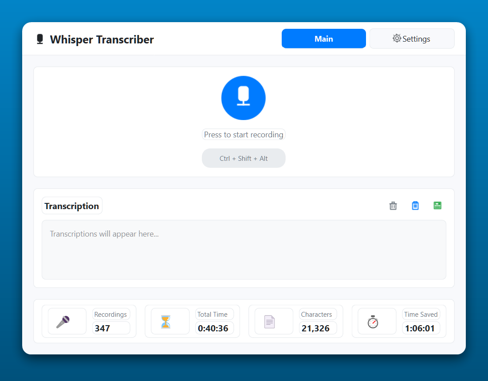
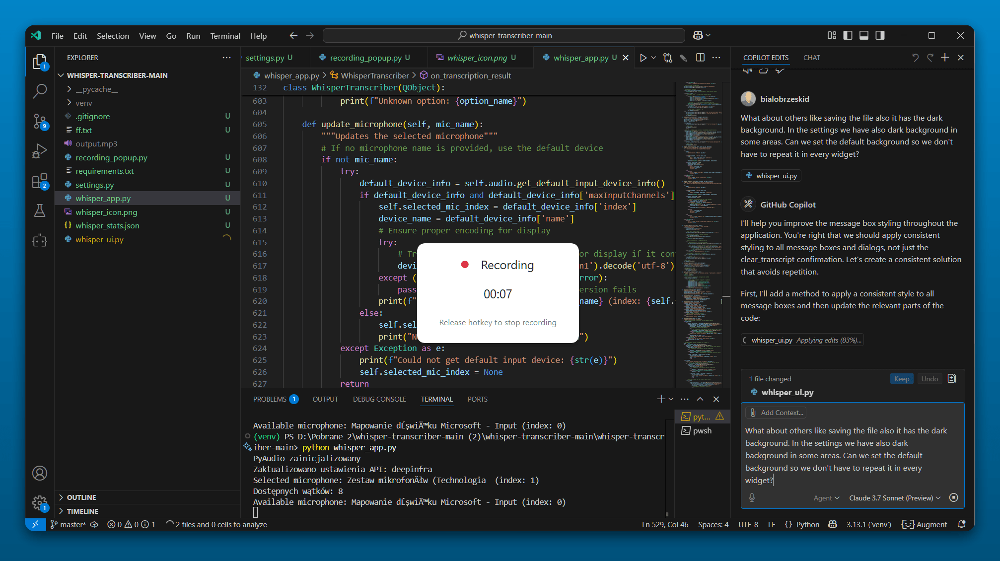
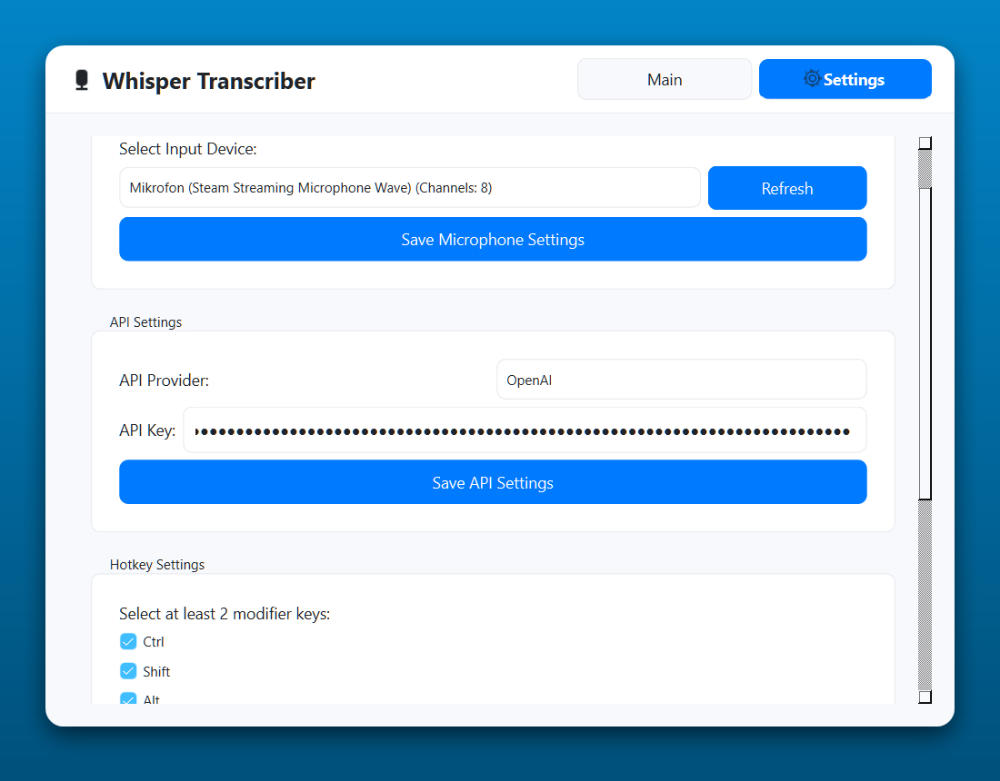

# Whisper Voice Transcription App

A modern desktop application for real-time voice transcription using OpenAI's Whisper or DeepInfra API. Built with Python and PyQt6.

## Screenshots

### Main Window


### Recording Status


### Settings


## Features

- Real-time voice recording with customizable hotkeys
- Support for multiple transcription APIs (OpenAI Whisper, DeepInfra)
- Modern, user-friendly interface with system tray integration
- Recording popup with timer and status indicators
- Automatic clipboard integration
- Recording statistics tracking
- Customizable microphone settings
- Sound and visual notifications

## Requirements

- Python 3.8+
- PyQt6
- pyaudio
- pynput
- pyperclip
- requests
- aiohttp

## Installation

1. Clone the repository:
```bash
git clone https://github.com/bialobrzeskid/Hold-To-Speak.git

cd whisper-transcription-app
```

2. Install dependencies:
```bash
pip install -r requirements.txt
```

3. Configure your API keys in the settings tab:
   - OpenAI API key
   - DeepInfra API key (better, faster, cheaper)

## Usage

1. Run the application:
```bash
python whisper_app.py
```

2. Configure your preferred:
   - Input device (microphone)
   - API provider (OpenAI/DeepInfra)
   - Hotkey combination (minimum 2 modifier keys)
   - Additional options (auto-paste, notifications)

3. Start recording:
   - Click the microphone button in the app
   - Or use the configured hotkey combination
   - Release the hotkey to stop recording

4. The transcription will appear in the main window and can be:
   - Automatically pasted to your active window
   - Copied to clipboard
   - Saved to a text file

## Project Structure

- `whisper_app.py` - Main application file
- `whisper_ui.py` - User interface components
- `recording_popup.py` - Recording status window

## License

MIT License


